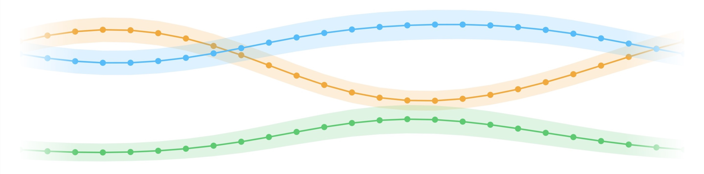

Hi, I'm Ole!

I'm a PhD student in the <a href="https://www.uni-bielefeld.de/fakultaeten/wirtschaftswissenschaften/lehrbereiche/stats/index.xml" target = "_blank">Statistics and Data Analysis Group</a> at Bielefeld University.

 

## Interests

I'm mainly interested in **doubly stochastic processes** like hidden Markov models, state space models and point processes and applications in ecology and sports. So far, I have worked on theoretical properties of inhomogeneous Markov chains, making hidden semi-Markov models more flexible, and efficient computational methods for spline-based nonparametric inference in latent Markovian models. To make such models more accessible to a wider audience, I wrote the R package <a href="https://janoleko.github.io/LaMa/" target = "_blank">LaMa</a>.

