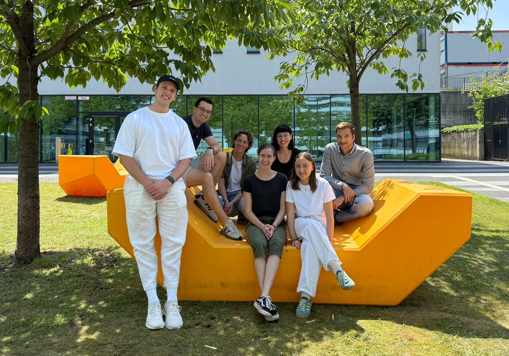

Hi, I'm Ole!

I'm a PhD student in the <a href="https://www.uni-bielefeld.de/fakultaeten/wirtschaftswissenschaften/lehrbereiche/stats/index.xml" target = "_blank">Statistics and Data Analysis Group</a> at Bielefeld University.

## Interests

I'm mainly interested in **doubly stochastic processes** like hidden Markov models, state space models and point processes, and applications in ecology and sports. So far, I have worked on the theoretical properties of inhomogeneous Markov chains, making hidden semi-Markov models more flexible, and efficient computational methods for spline-based nonparametric inference in latent Markovian models. 

To make such models more accessible to a wider audience, I wrote the R package <a href="https://janoleko.github.io/LaMa/" target = "_blank">`LaMa`</a>. If you want to get an overview of the class of **latent Markov models** check out our <a href = "https://journals.sagepub.com/doi/full/10.1177/1471082X251355681" target = "_blank">review paper</a>.

Recently, we wrote two papers on interpreting HMMs with covariates effects in a <a href="https://projecteuclid.org/journals/annals-of-applied-statistics/volume-19/issue-4/Inference-on-the-state-process-of-periodically-inhomogeneous-hidden-Markov/10.1214/25-AOAS2107.short" target="_blank">periodic setting</a> or in <a href="https://arxiv.org/abs/2512.17496" target="_blank">general</a>.

