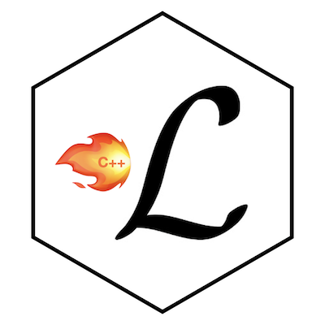

## Lcpp 
I wrote the R package **Lcpp** for flexible model building and fast estimation of **latent Markov models**.

* <a href = "https://github.com/janoleko/Lcpp" target = "_blank">Github</a>

## EgoCor
Julia Dyck and I developed the R package **EgoCor** as a user-friendly interface based on the R package `gstat` to fit exponential parametric models to empirical semi-variograms to model the spatial correlation structure of health data.

* <a href = "https://cran.r-project.org/web/packages/EgoCor/index.html" target="_blank">CRAN</a>: Including detailed documentation.
* <a href = "" target = "_blank">Github</a>: most recent version.
