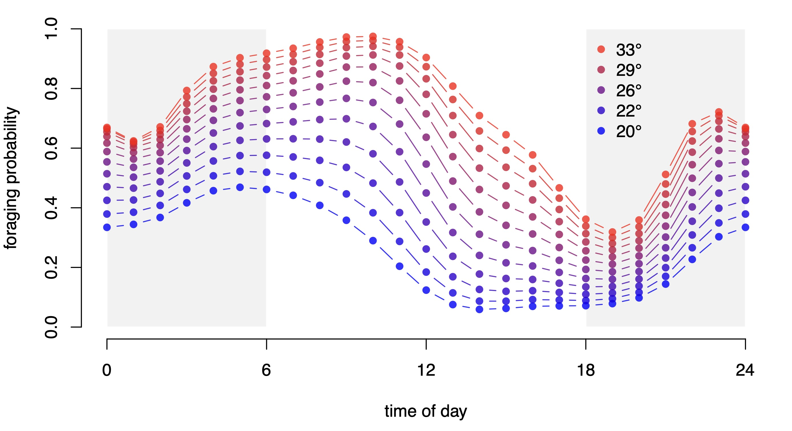
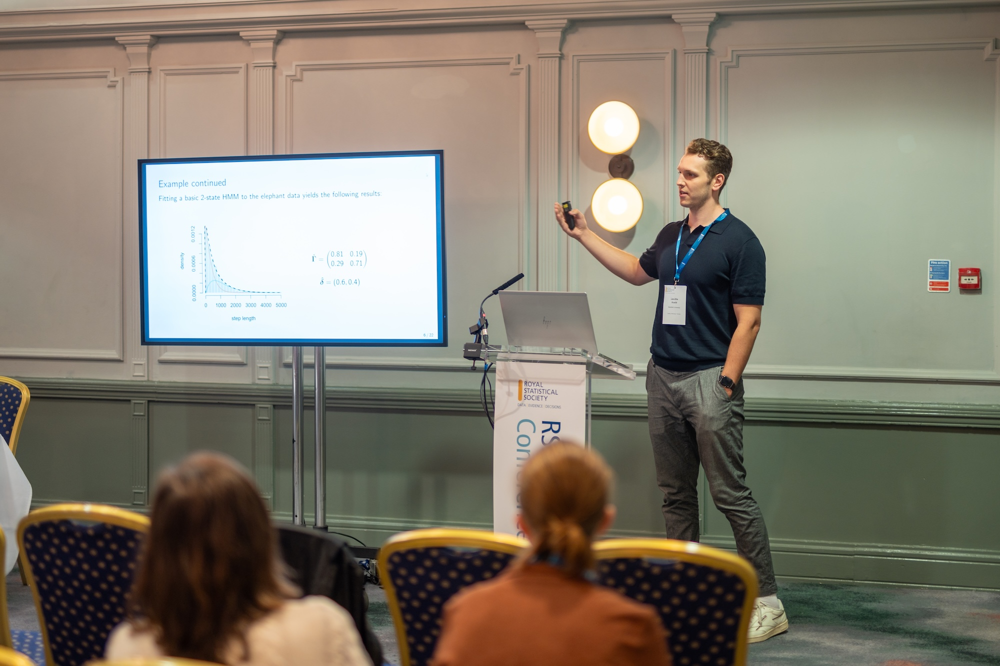

## Talks

**Efficient smoothness selection for nonparametric Markov-switching models via quasi restricted maximum likelihood** 
24. September 2024,
Statistics Seminar, Göttingen, Germany
 

**Exploring hidden dynamics: statistical inference in periodically inhomogeneous hidden Markov models for animal behaviour** 
4. September 2024,
Royal Statistical Society Conference, Brighton, UK

**Inference on the state process of periodically inhomogeneous hidden Markov models for animal behaviour** 
17. July 2024,
International Statistical Ecology Conference, Swansea, Wales
 

**Inference on the state process of periodically inhomogeneous hidden Markov models** 
16. February 2024,
Young Researchers Workshop of the Center for Statistics, Bielefeld University
 
I held a short presentation about our paper [Inference on the state process of periodically inhomogeneous hidden Markov models for animal behaviour](https://arxiv.org/abs/2312.14583). We established novel tools to better understand the state process of periodically inhomogeneous hidden Markov models regarding i) the periodically varying unconditional state distribution and ii) the state dwell-time distribution. This was illustrated using the movement track of an elphant from the Ivory Coast. You can download the slides [here](../files/slides/slides_YRW.pdf).

**Mitigating consequences of the Markov assumption** 
24. October 2023,
Colloquium of the Center for Statistics, Bielefeld University
 
I presented the results of my master thesis which focussed on methods for mitigation the undesired consequences of the Markov assumption in hidden Markov models. In particular, I derived properties of the state process of periodically inhomogeneous Markov chains, and extended the model class of hidden semi-Markov models to allow for inhomogeneity in the state dwell-time distributinos. You can download the slides [here](../files/slides/slides_ZeSt.pdf).

## Posters

**Mitigating consequences of the Markov assumption** 
4. December 2023,
Doctoral workshop of the Bielefeld Graduate School of Economics and Management (BiGSEM), Bielefeld University
 
I also presented the results of my master thesis as a poster in the 18. doctoral workshop of the Bielefeld Graduate School of Economics and Management (BiGSEM). You can download the poster [here](../files/slides/Poster_BIGSEM_workshop_Koslik.pdf).

